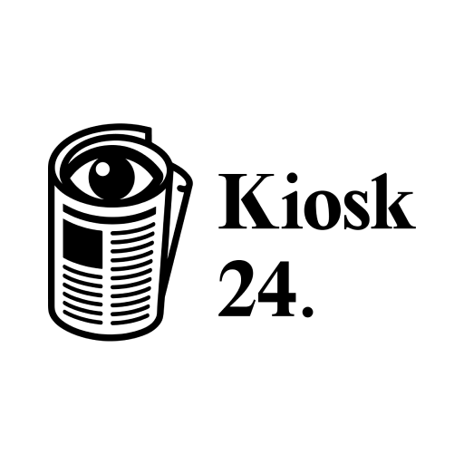
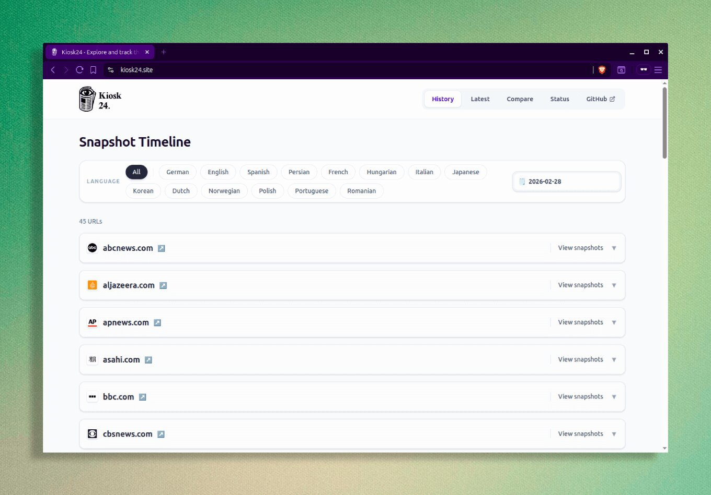
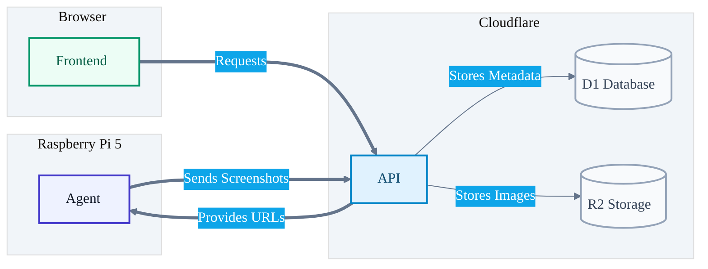

<div align="center">



Kiosk24 (from kušk, Persian for “small pavilion” and “newsstand”) is designed to take hourly (`0 * * * *`) screenshots of news websites by taking regular screenshots across desktop and mobile device viewports . It allows users to track visual changes over time and compare different versions.

The screenshot agent runs on a Raspberry Pi 5.

I was inspired to build this project by https://youtube.com/watch?v=JTOJsU3FSD8&t=118s



</div>

## Project Structure

This project is a monorepo:

- **[apps/agent](./apps/agent)**: A Playwright-based screenshot
- **[apps/api](./apps/api)**: A Hono-based backend API running on Cloudflare Workers
- **[apps/web](./apps/web)**: An Astro-based frontend 
- **[libs/shared](./libs/shared)**: Shared TypeScript types, Drizzle ORM and zod


## Tech Stack

* **Frontend**: [Astro][1] ([Astro joins Cloudflare][2]), [Preact][3], [Tailwind CSS][4]
* **Security**: [/dashboard protected with Cloudflare Zero Trust][5]
* **Backend**: [Hono][6] (Cloudflare Workers), [Drizzle ORM][7]
* **Database**: [Cloudflare D1][8]
* **Storage**: [Cloudflare R2][9]
* **DNS**: [Cloudflare DNS][10]
* **Image Optimization**: [Cloudflare Image Transformations][11]
* **Agent**: [Playwright][12], [tsup][13]
* **Monorepo Management**: [pnpm][14]
* **Linting/Formatting**: [Biome][15]


## Local Development

### Prerequisites

* **Node.js**
* **pnpm**

**1. Clone & Install**
```bash
git clone https://github.com/herol3oy/kiosk24.git
cd kiosk24
pnpm install
```

**2. Generate API Key**

```bash
openssl rand -base64 32
```

**3. Setup Environment Variables**


* **`agent/.env`**
  ```env
  API_BASE_URL=http://localhost:8787
  API_KEY=<generated_key>
  ```
* **`api/.env`**
  ```env
  CLOUDFLARE_ACCOUNT_ID=
  CLOUDFLARE_DATABASE_ID=
  CLOUDFLARE_D1_TOKEN=
  API_KEY=<generated_key>
  ```
* **`web/.env`**
  ```env
  PUBLIC_CDN_URL=http://localhost:8787
  API_KEY=<generated_key>
  ```

**4. Initialize the Database**
```bash
cd apps/api
npx wrangler d1 migrations apply kiosk24 
```

**5. Run the Stack**

```bash
pnpm --parallel --filter api --filter web run dev
```

**6. Configure & Start Agent**
1. Go to [http://localhost:4321/dashboard](http://localhost:4321/dashboard)
2. Add URLs and languages.
3. Start the agent:
```bash
pnpm --filter agent run dev
```

[1]: https://astro.build/
[2]: https://blog.cloudflare.com/astro-joins-cloudflare/
[3]: https://preactjs.com/
[4]: https://tailwindcss.com/
[5]: https://www.cloudflare.com/products/zero-trust/
[6]: https://hono.dev/
[7]: https://orm.drizzle.team/docs/get-started/d1-new
[8]: https://developers.cloudflare.com/d1/
[9]: https://developers.cloudflare.com/r2/
[10]: https://cloudflare.com/application-services/products/dns/
[11]: https://developers.cloudflare.com/images/transform-images/
[12]: https://playwright.dev/
[13]: https://tsup.egoist.dev/
[14]: https://pnpm.io/
[15]: https://biomejs.dev/
