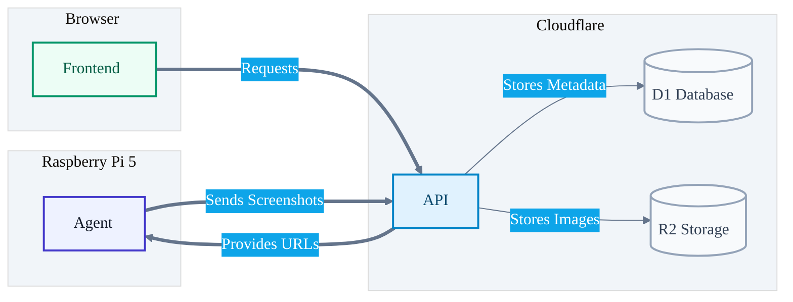

# kiosk24

Kiosk24 (from Persian kušk, small garden) is designed to monitor a list of URLs by taking regular screenshots across desktop and mobile device viewports . It allows users to track visual changes over time and compare different versions.

I was inspired to build this project by https://youtube.com/watch?v=JTOJsU3FSD8&t=118s

## Project Structure

This project is a monorepo:

- **[apps/agent](./apps/agent)**: A Playwright-based screenshot
- **[apps/api](./apps/api)**: A Hono-based backend API running on Cloudflare Workers
- **[apps/web](./apps/web)**: An Astro-based frontend 
- **[libs/shared](./libs/shared)**: Shared TypeScript types, Drizzle ORM and zod

## Tech Stack

- **Frontend**: [Astro](https://astro.build/), [Preact](https://preactjs.com/), [Tailwind CSS](https://tailwindcss.com/)
- **Backend**: [Hono](https://hono.dev/) (Cloudflare Workers), [Drizzle ORM](https://orm.drizzle.team/)
- **Database**: [Cloudflare D1](https://developers.cloudflare.com/d1/)
- **Storage**: [Cloudflare R2](https://developers.cloudflare.com/r2/)
- **Agent**: [Playwright](https://playwright.dev/), [tsup](https://tsup.egoist.dev/)
- **Monorepo Management**: [pnpm](https://pnpm.io/)
- **Linting/Formatting**: [Biome](https://biomejs.dev/)
